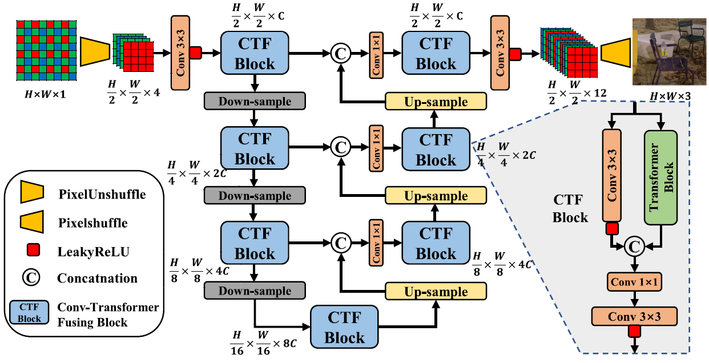
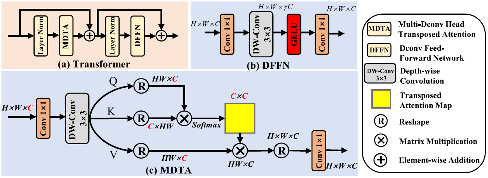
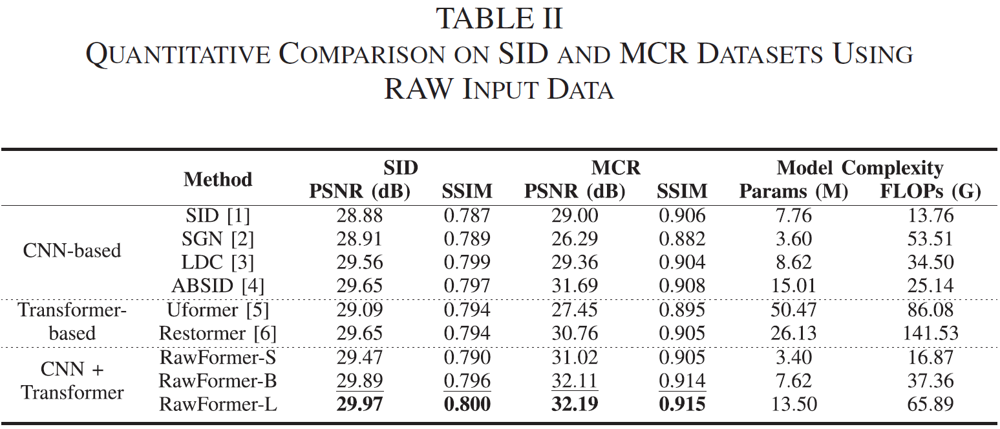

# RawFormer: An Efficient Vision Transformer for Low-Light RAW Image Enhancement

[Wanyan Xu](https://scholar.google.com/citations?user=SotIR58AAAAJ&hl=en), [Xingbo Dong](https://xingbod.github.io/), [Lan Ma](https://ieeexplore.ieee.org/author/37089542866), [Andrew Beng Jin Teoh](https://scholar.google.com/citations?user=ueRkvQMAAAAJ&hl=en), and [Zhixian Lin](https://xjzz.fzu.edu.cn/info/1012/1142.htm)

[](https://ieeexplore.ieee.org/document/10002844)

<hr />

> **Abstract:** *Low-light image enhancement plays a central role in
various downstream computer vision tasks. Vision Transformers
(ViTs) have recently been adapted for low-level image processing
and have achieved a promising performance. However, ViTs process
images in a window- or patch-based manner, compromising
their computational efficiency and long-range dependency. Additionally,
existing ViTs process RGB images instead of RAW data
from sensors, which is sub-optimal when it comes to utilizing the
rich information from RAW data. We propose a fully end-to-end
Conv-Transformer-based model, RawFormer, to directly utilize
RAW data for low-light image enhancement. RawFormer has a
structure similar to that ofU-Net, but it is integrated with a thoughtfully
designed Conv-Transformer Fusing (CTF) block. The CTF
block combines local attention and transposed self-attention mechanisms
in one module and reduces the computational overhead
by adopting a transposed self-attention operation. Experiments
demonstrate that RawFormer outperforms state-of-the-art models
by a significant margin on low-light RAW image enhancement
tasks.* 
<hr />

## Network Architecture



## Package dependencies
This project is built by Python 3.8, Pytorch 1.12, CUDA 11.6. For other python package dependencies:
```
pip install -r requirements.txt
```

## Pretrain Model
- RawFormer-Small: [SID](https://drive.google.com/file/d/1GbyZCbD-WRk7Tv6DHAM5eZddSHcJ3Za3/view?usp=share_link) | [MCR](https://drive.google.com/file/d/1wVgcg5yPmh7y-pDrGI1-u_-o2er1ZqAx/view?usp=share_link)
- RawFormer-Base : [SID](https://drive.google.com/file/d/14XpqKHodtEfkLS5Ur-JF0ByizrcEoXxI/view?usp=share_link) | [MCR](https://drive.google.com/file/d/1CC7aepx1GMel6grvcVBmQVO1PR3l_OWR/view?usp=share_link)
- RawFormer-Large: [SID](https://drive.google.com/file/d/1YMFrkI4c44N83iBXosjg_GO6GRXKJWCV/view?usp=share_link) | [MCR](https://drive.google.com/file/d/1AbzjtSxrhpP4W1GQn8fVNHIDe_qg9Ipj/view?usp=share_link)

Download the pretrained model to the corresponding [weights](result/SID/weights) folders under `result` folder.

## Training and Evaluation
Download the [SID(Sony part)](https://github.com/cchen156/Learning-to-See-in-the-Dark) and [MCR](https://github.com/TCL-AILab/Abandon_Bayer-Filter_See_in_the_Dark) datasets, and put them under the `RawFormer` directory.
The folders should be like:

<hr />

- RawFormer 
  - Sony (SID dataset Sony part)
  - Mono_Colored_RAW_Paired_DATASET (MCR dataset)
  - result
    - MCR
    - SID
  - figs
  - . . . . . .

<hr />

To train and evaluate RawFormer on SID or MCR, set the options in `train.py` or `test.py`, and run:
```
python train.py
python test.py
```

## Results
The PSNR-FLOPs-Params comparison on SID dataset:


## Citation
If you find this project useful in your research, please consider citing:

    @article{xu2022rawformer,
      title={RawFormer: An Efficient Vision Transformer for Low-Light RAW Image Enhancement},
      author={Xu, Wanyan and Dong, Xingbo and Ma, Lan and Teoh, Andrew Beng Jin and Lin, Zhixian},
      journal={IEEE Signal Processing Letters},
      volume={29},
      pages={2677--2681},
      year={2022},
      publisher={IEEE}
    }

**Acknowledgment:**
This code is based on the [Uformer](https://github.com/ZhendongWang6/Uformer) and [Restormer](https://github.com/swz30/Restormer).

## Contact
If you have any questions or suggestions, please contact xuwanyan98@163.com or xingbod@gmail.com.

## Our Related Work
- Abandoning the Bayer-Filter to See in the Dark, CVPR 2022. [Paper](https://arxiv.org/abs/2203.04042) | [Code](https://github.com/TCL-AILab/Abandon_Bayer-Filter_See_in_the_Dark)

## LICENSE
<a rel="license" href="http://creativecommons.org/licenses/by-nc/4.0/"></a><br />This work is licensed under a <a rel="license" href="http://creativecommons.org/licenses/by-nc/4.0/">Creative Commons Attribution-NonCommercial 4.0 International License</a>.
